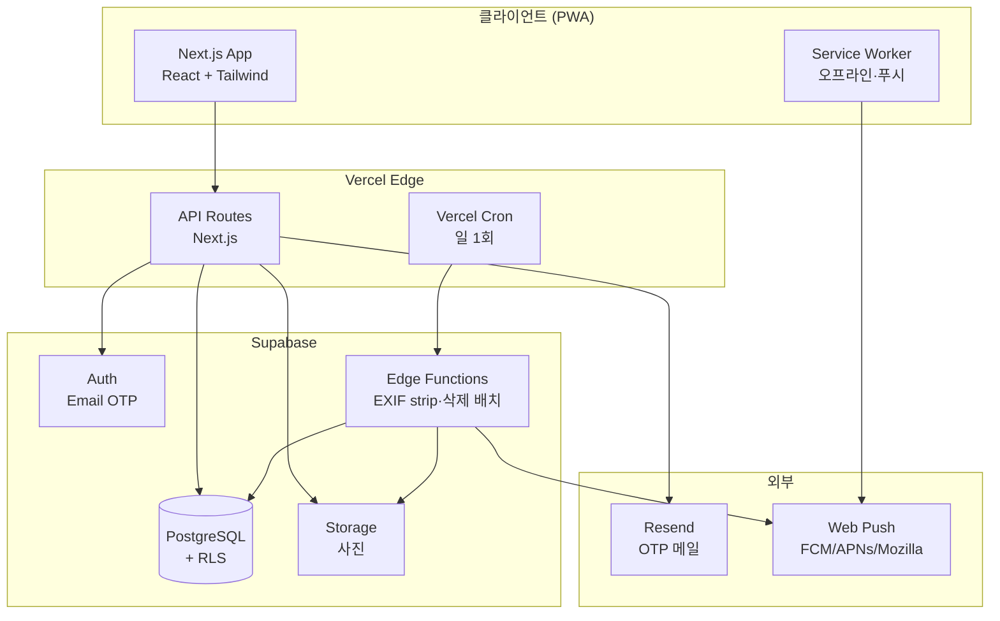
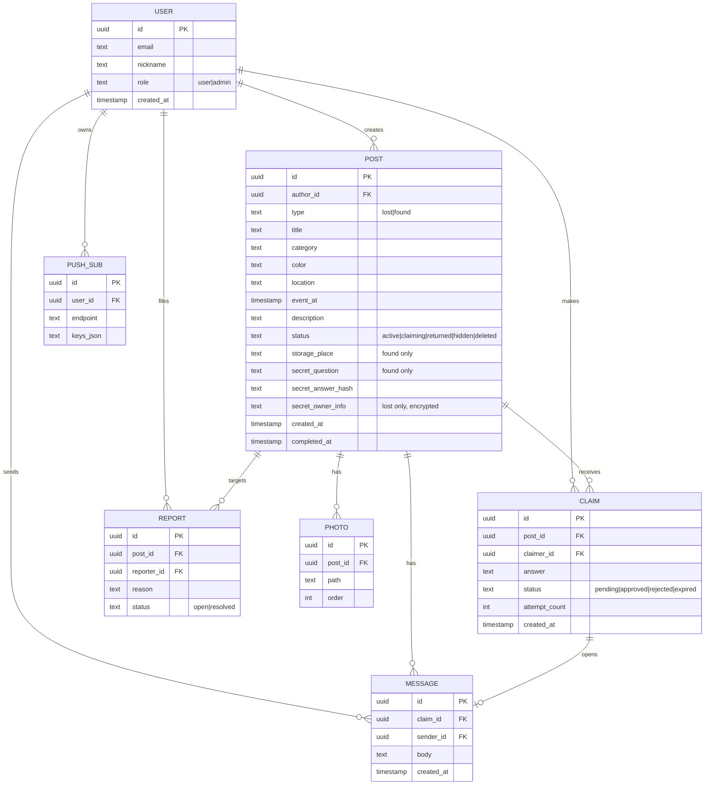
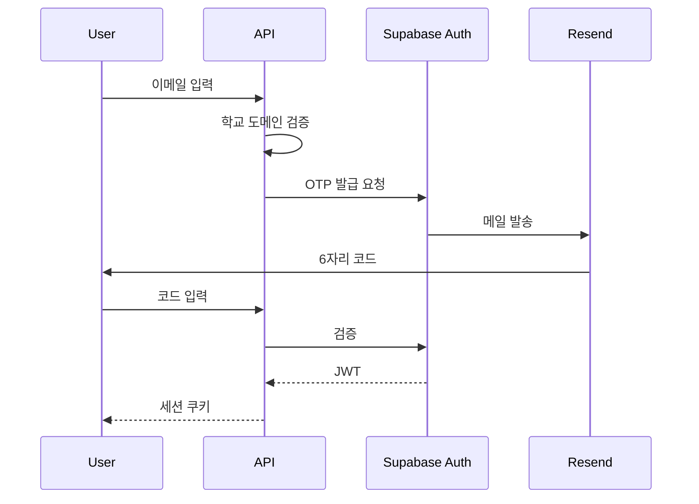
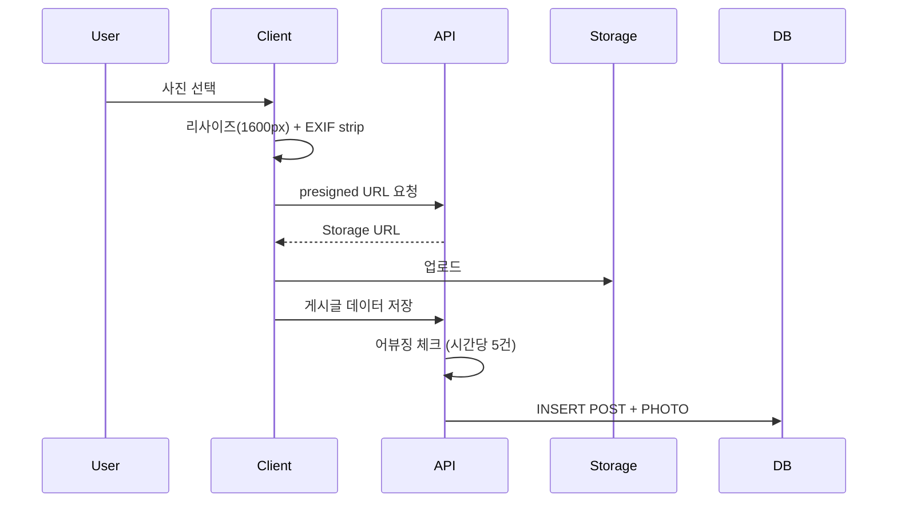
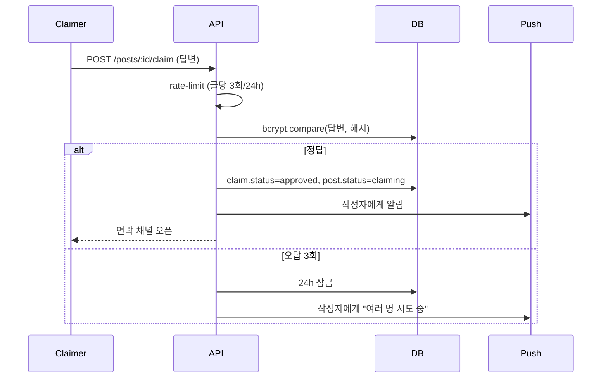
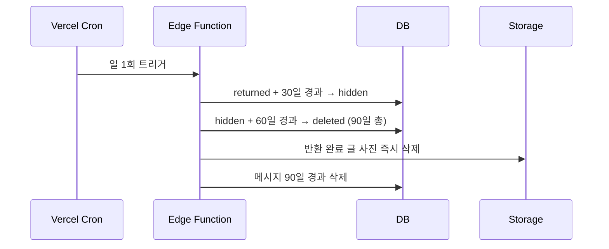
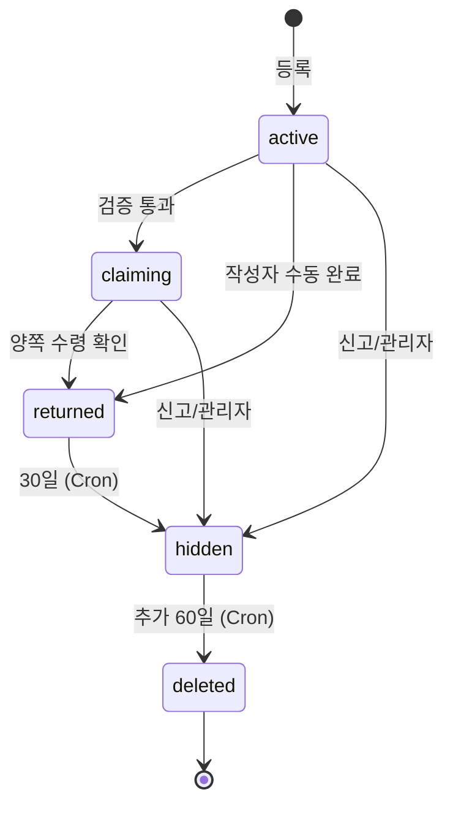

# 스쿨줍줍 아키텍처

[IDEATION.md](IDEATION.md) 기획을 기준으로 한 기술 아키텍처. MVP 범위에 맞춘 단순·실용 우선.

---

## 1. 기술 스택

| 영역 | 선택 | 이유 |
|---|---|---|
| 프레임워크 | Next.js 14 (App Router) | 단일 코드베이스 SSR/API/PWA, Vercel 무료 배포 |
| 언어 | TypeScript | 타입 안전 |
| UI | React + Tailwind CSS + shadcn/ui | 빠른 모바일 UI |
| 상태 관리 | React Query (서버) + Zustand (UI) | 캐싱·동기화 |
| DB | PostgreSQL (Supabase) | 무료 티어, RLS, 인증 통합 |
| 인증 | Supabase Auth (Email OTP) | 학교 도메인 검증 미들웨어 |
| 파일 저장 | Supabase Storage (S3 호환) | DB와 한 곳 |
| 푸시 | Web Push API (VAPID) | PWA 표준, 무료 |
| 배치 작업 | Vercel Cron + Supabase Edge Functions | 자동 비공개/삭제 |
| 이메일 발송 | Resend | OTP 발송 |
| 이미지 처리 | sharp (서버) + browser-image-compression (클라) | EXIF 제거·리사이즈 |
| 어뷰징 방지 | Upstash Redis (Serverless) | 분산 환경 rate limit |
| 호스팅 | Vercel | PWA·Edge 함수·Cron 통합 |

---

## 2. 시스템 구성도



---

## 3. 디렉터리 구조

```
app/
├── (auth)/login              # OTP 로그인
├── (main)/
│   ├── page.tsx              # 홈 (검색·리스트)
│   ├── posts/[id]            # 상세
│   ├── posts/new             # 등록
│   ├── me                    # 마이페이지
│   └── admin                 # 관리자 콘솔
├── api/
│   ├── auth/otp              # OTP 발급·검증
│   ├── posts                 # CRUD
│   ├── posts/[id]/claim      # 소유권 검증 시도
│   ├── posts/[id]/verify     # 검증 응답
│   ├── posts/[id]/contact    # 연락 요청·메시지
│   ├── posts/[id]/complete   # 수령 확인
│   ├── reports               # 신고
│   ├── push/subscribe        # 푸시 구독
│   └── admin/*               # 관리자 API
lib/
├── supabase/                 # 클라/서버 클라이언트
├── auth/domain.ts            # 학교 도메인 검증
├── image/exif.ts             # EXIF 제거
├── rate-limit.ts             # 어뷰징 방지
└── push/                     # Web Push 발송
public/
├── manifest.json             # PWA
└── sw.js                     # Service Worker
```

---

## 4. 데이터 모델 (ERD)



**인덱스 전략**

| 테이블 | 인덱스 | 용도 |
|---|---|---|
| POST | `(status, created_at desc)` | 홈/리스트 정렬 |
| POST | `(category, location, status)` | 필터 조합 |
| POST | `tsvector(title + description)` GIN | 키워드 검색 (PG FTS) |
| POST | `(author_id, created_at desc)` | 마이페이지 |
| CLAIM | `(post_id, claimer_id)` UNIQUE | 중복 시도 차단 |
| CLAIM | `(claimer_id, created_at desc)` | 진행 중 매칭 조회 |
| MESSAGE | `(claim_id, created_at)` | 대화 정렬 |
| REPORT | `(status, created_at)` | 관리자 큐 |
| PUSH_SUB | `(user_id)` | 사용자 디바이스 조회 |

---

## 5. 핵심 흐름

### 5.1 회원가입·로그인 (Email OTP)


### 5.2 등록 (사진 EXIF 제거)


### 5.3 양방향 소유권 검증


### 5.4 자동 만료 (Cron)


---

## 6. 보안

| 항목 | 방법 |
|---|---|
| 인증 | Supabase JWT, HttpOnly 쿠키 |
| 권한 | PostgreSQL Row-Level Security (작성자/관리자만 수정) |
| 비공개 답변 | bcrypt 해시 저장, 평문 미보관 |
| 분실물 비공개 정보 | Supabase Vault로 암호화 저장 |
| 사진 메타데이터 | sharp `.withMetadata(false)` 로 EXIF/GPS 제거 |
| 어뷰징 | Upstash Redis로 rate limit (등록·검증·신고·로그인) |
| 학교 도메인 검증 | 화이트리스트 도메인만 OTP 발송 |
| XSS | React 기본 이스케이프 + 사용자 입력 sanitize |
| CSRF | SameSite=Lax 쿠키, Origin 검증 |
| 업로드 | MIME 검증, 크기 5MB 제한, 확장자 화이트리스트 |

---

## 7. 상태 머신 (POST)



---

## 8. 푸시 알림

- 브라우저 Web Push API + VAPID 키
- 구독 정보(endpoint, p256dh, auth)를 `PUSH_SUB`에 저장
- 트리거: 신규 검증 요청, 검증 결과, 상태 변경
- 발송: `web-push` npm 라이브러리, API Route에서 직접

---

## 9. 배포·환경

| 환경 | 용도 |
|---|---|
| Production | Vercel + Supabase Prod |
| Preview | Vercel PR 자동 배포 + Supabase Branch |
| Local | Next.js dev + Supabase CLI 로컬 |

### 환경 변수
```
NEXT_PUBLIC_SUPABASE_URL
NEXT_PUBLIC_SUPABASE_ANON_KEY
SUPABASE_SERVICE_ROLE_KEY
RESEND_API_KEY
VAPID_PUBLIC_KEY
VAPID_PRIVATE_KEY
ALLOWED_EMAIL_DOMAINS  # ex) school.ac.kr
UPSTASH_REDIS_URL
UPSTASH_REDIS_TOKEN
```

---

## 10. 비용 (학생 프로젝트 가정, 월)

| 서비스 | 무료 한도 | 예상 사용 |
|---|---|---|
| Vercel Hobby | 100GB 대역폭 | OK |
| Supabase Free | 500MB DB, 1GB Storage, 50K MAU | OK |
| Resend Free | 100건/일, 3000건/월 | OK |
| Upstash Free | 10K 명령/일 | OK |

→ 학교 1곳 규모는 전부 무료 티어 내 가능.

---

## 11. 개발 순서 (MVP 빌드 권장)

1. Next.js + Supabase 프로젝트 초기화, RLS 정책
2. Auth (도메인 화이트리스트 OTP)
3. POST CRUD + 사진 업로드(EXIF 제거)
4. 리스트 + 검색·필터
5. 상세 화면
6. 양방향 소유권 검증 + 메시지 1회
7. 상태 머신 + 신고
8. 마이페이지
9. 관리자 콘솔
10. PWA manifest + Service Worker + Web Push
11. Cron(자동 비공개/삭제)
12. Rate limit + 약관·개인정보 페이지

---

## 12. 검색 구현

**MVP — PostgreSQL Full-Text Search**

- `title`, `description`, `color`를 합쳐 `tsvector` 컬럼 생성, GIN 인덱스
- 한글: `pg_bigm` 또는 `pg_trgm` 으로 부분 일치 보완 (PG FTS만으론 한글 형태소 약함)
- 필터(카테고리·장소·기간·상태)는 일반 WHERE 절
- 정렬: 최신순 기본, 검색 시 `ts_rank` 가중치

```sql
-- 예시: 게시글 검색
SELECT * FROM posts
WHERE status IN ('active', 'claiming')
  AND search_vector @@ plainto_tsquery('simple', $1)
  AND ($2::text IS NULL OR category = $2)
  AND ($3::text IS NULL OR location = $3)
ORDER BY ts_rank(search_vector, plainto_tsquery('simple', $1)) DESC,
         created_at DESC
LIMIT 20;
```

**v1.5 — 유사 게시글 추천**

- 신규 등록 시 같은 카테고리 + 같은 장소 + 일시 ±3일 게시글 조회
- 작성자에게 "유사한 글이 있어요" 카드 노출

**v2 — 이미지 유사도**

- CLIP 임베딩 → pgvector `<->` 거리 계산

---

## 13. 푸시 알림 트리거 매트릭스

| 이벤트 | 수신자 | 제목 (예) | 페이로드 |
|---|---|---|---|
| 새 검증 요청 도착 | 게시글 작성자 | "누군가 본인 물건이라고 합니다" | `{ type: 'claim_new', postId, claimId }` |
| 검증 승인 | 검증 시도자 | "소유권 확인 완료, 연락 가능" | `{ type: 'claim_approved', postId, claimId }` |
| 검증 거절/실패 | 검증 시도자 | "답변이 일치하지 않습니다" | `{ type: 'claim_rejected', postId }` |
| 메시지 도착 | 상대방 | "새 메시지가 도착했습니다" | `{ type: 'message', claimId }` |
| 수령 확인 완료 | 양쪽 모두 | "반환 완료 처리되었습니다" | `{ type: 'returned', postId }` |
| 다중 시도 감지 | 게시글 작성자 | "여러 명이 본인 물건이라고 시도 중" | `{ type: 'claim_multi', postId }` |
| 관리자 숨김 처리 | 게시글 작성자 | "신고로 인해 글이 숨김 처리되었습니다" | `{ type: 'admin_hide', postId }` |

발송은 모두 API Route에서 `web-push` 라이브러리로 처리. 사용자가 알림을 끄면 `PUSH_SUB` 행 삭제.

---

## 14. 에러 처리·로깅

| 계층 | 도구 / 방법 |
|---|---|
| 클라이언트 에러 | React Error Boundary + Toast |
| 서버 에러 | Next.js `error.tsx` + JSON 응답 `{ code, message }` 표준화 |
| 에러 추적 | Sentry (무료 티어) — 클라/서버 통합 |
| 구조화 로깅 | `pino` JSON 로그 → Vercel Log Drain |
| 사용자 행동 | Vercel Analytics (페이지뷰), 별도 이벤트 테이블에 핵심 액션 기록 |
| Cron 실패 | Sentry Cron Monitor + 관리자 이메일 |

**에러 코드 규칙** — `AUTH_*`, `POST_*`, `CLAIM_*`, `RATE_LIMIT_*` 접두어. 클라이언트는 코드로 분기, 메시지는 i18n 가능하도록 분리.

---

## 15. 운영 지표

기획서 "기대효과"를 측정하기 위한 데이터 수집.

| 지표 | 수집 방법 |
|---|---|
| 평균 매칭 소요 시간 | `returned_at - created_at` 평균 |
| 분실물 회수율 | `반환 완료 / 전체 등록` 비율 |
| MAU / 가입자 | 30일 내 로그인 사용자 카운트 |
| 신고 발생률 | `report 건수 / post 건수` |
| 검증 실패율 | `claim.rejected / claim 전체` |

관리자 콘솔에 간단한 대시보드 페이지(차트 1~2개)로 노출.

---

## 16. 테스트 전략

학생 프로젝트 수준에 맞춘 최소·실용 테스트.

| 종류 | 도구 | 대상 |
|---|---|---|
| 단위 | Vitest | rate-limit, EXIF 제거, 도메인 검증, 상태 전이 함수 |
| 통합 | Vitest + Supabase 로컬 | API Route — 등록/검증/메시지 |
| E2E | Playwright (1~2 시나리오) | 등록 → 검증 → 메시지 → 수령 확인 |
| 수동 사용성 | 학생 3명 모집 | 가짜 분실물로 end-to-end 1회 |

CI는 GitHub Actions로 PR마다 lint + 단위 + 통합 테스트.

---

## 17. v2 이후 확장 고려

- 인앱 1:1 채팅: Supabase Realtime
- 자동 매칭 알림: 위 "검색 구현 v1.5" 확장 → 신규 등록 시 매칭되는 분실자에게 즉시 푸시
- 이미지 유사도: CLIP 임베딩 + pgvector
- 다중 학교: `school_id` 컬럼 + 도메인 매핑 테이블, RLS에 school 격리 추가
- 네이티브 앱: Capacitor로 PWA 래핑
- 다국어(영어): next-intl
