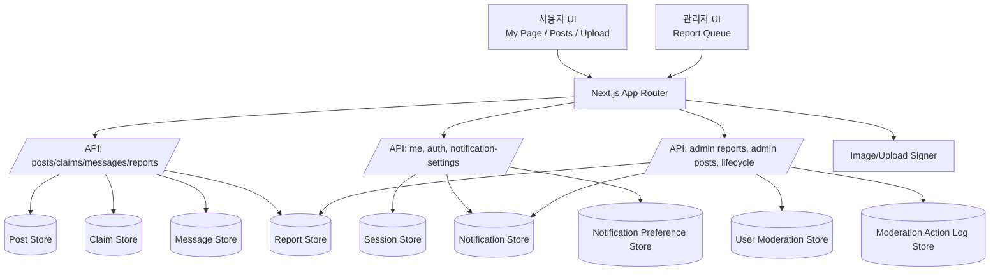

# 분실물/습득물 커뮤니티 웹 애플리케이션

## 애플리케이션 개요

이 프로젝트는 학교/캠퍼스 환경에서 분실물과 습득물 정보를 공유하고, 신고/제재/알림 흐름까지 포함해 운영할 수 있도록 설계된 Next.js 기반 웹 애플리케이션입니다.

핵심 기능:

- 분실/습득 게시글 생성 및 조회
- 클레임(소유자 확인, 습득자 요청) 처리
- 게시글 기반 메시지 전달
- 사용자 알림 및 알림 설정(on/off)
- 관리자 신고 큐, 게시글 조치, 사용자 제재(warn/suspend/unsuspend)
- 운영성 기능(라이프사이클 정리, 만료 데이터 정리)

## 전체 아키텍쳐 다이어그램



## 시작하기

### 사전 개발 환경 요구사항 (Prerequisites)

- Node.js 20 이상 권장
- npm 10 이상 권장
- Git

버전 확인:

```bash
node -v
npm -v
git --version
```

### 애플리케이션 실행하기 (로컬)

1. 의존성 설치

```bash
npm install
```

2. 개발 서버 실행

```bash
npm run dev
```

3. 브라우저에서 확인

- http://localhost:3000

### 애플리케이션 배포하기 (Azure)

추후 작성 예정

### 애플리케이션 테스트

정적 분석(린트):

```bash
npm run lint
```

전체 테스트 실행:

```bash
npm run test
```

테스트 감시 모드:

```bash
npm run test:watch
```
